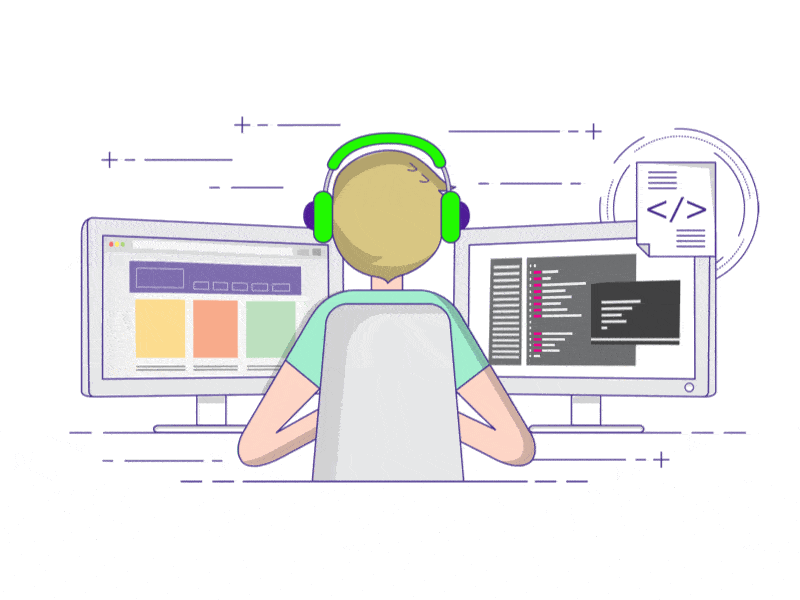

<h1 align="center">
    <h1 align="center" text-color = "white">Hey Everyone 👋, I'm Harshpalsinh R Jadeja</h1>
</h1>

  

<h4 align="center" color="smoke-white">A passionate frontend developer from India. As a web developer, I have experience with HTML, CSS, and JavaScript. Meticulous web developer with over 6 Months of front end experience and passion for responsive website design and a firm believer in the mobile-first approach.</h4>

 

 

 
 🔭 I’m currently working on [Netflix Clone](https://harshpalsinh05.github.io/Netflix-Clone/)
 
 🌱 I’m currently learning **Sass, JavaScript, React.js**

 👯 First Webiste Clone [University Website Clone](https://harshpalsinh05.github.io/A-University-Website/)

 🌃 My Design Engineering Project [Avsar (Event Management Website)](https://harshpalsinh05.github.io/Avasar/)

👨‍💻 All of my projects are available at [https://github.com/harshpalsinh05](https://github.com/harshpalsinh05)

 📄 Know about my experiences [https://harshpalsinh05.github.io/Main-Portfolio/](https://harshpalsinh05.github.io/Main-Portfolio/)

- ⚡ Fun fact **I like to design and develop cool webiste.**
 
 

 

 
  
  
  <a href="https://harshpalsinh05.github.io/Main-Portfolio/" target="_blank">
      <!-- sqlite, safari, google-chrome are other good icon options -->
  </a>

 

 
<h2 align="center">⚒️ Languages-Frameworks-Tools ⚒️</h2>
 

     
    

 

  <h2>🐍 My Contributions 🐍</h2>
   
  
  
     

&nbsp;

